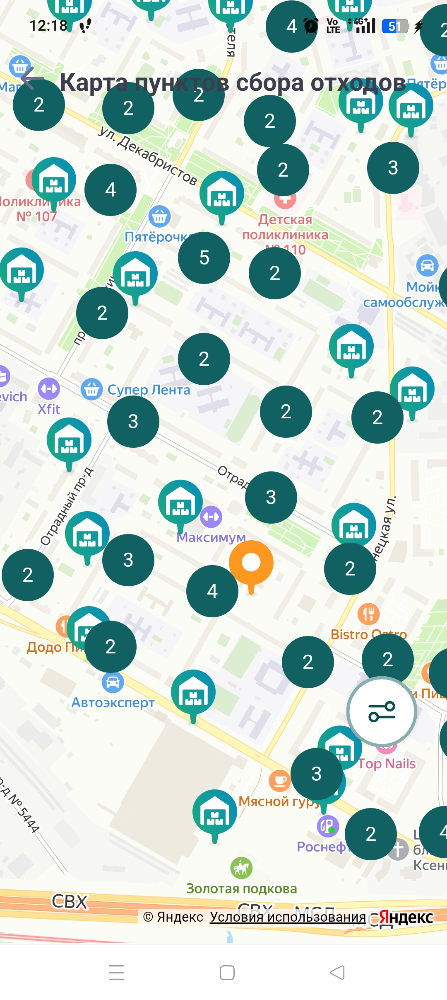
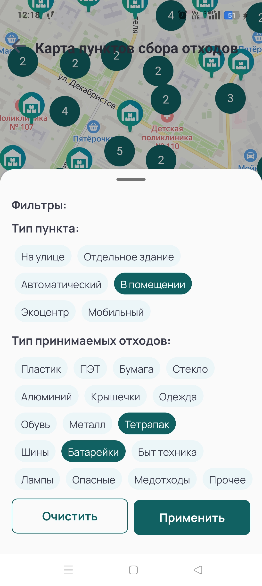
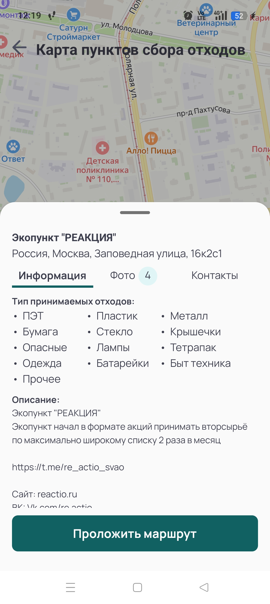

# ♻️ ПРОЕКТ RecycleMap: Интерактивная карта пунктов приема отходов 

Проект с проектного семинара 3 курса [Факультета Компьютерных наук НИУ ВШЭ](https://cs.hse.ru/).

Цель проекта - разработка мобильного приложения с интерактивной картой пунктов приема отходов по всей России. 

---

## 📸 Скриншоты

<table>
  <tr>
    <td align="center">
       Карта пунктов
    </td>
    <td align="center">
       Фильтры поиска
    </td>
    <td align="center">
       Карточка пункта
    </td>
  </tr>
</table>

---

## 📝 Авторы

- Максим Кайгородов, НИУ ВШЭ ФКН
---

## ©️ License

Применяется только в учебных/личных целях.

---
